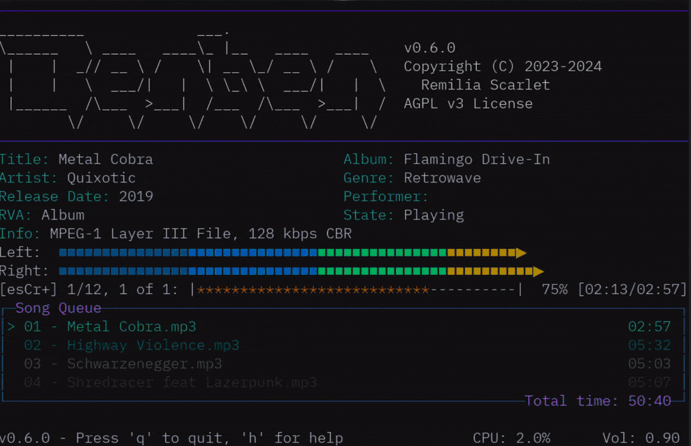

<h1>Awesome Common Lisp Application Software</h1>

---

This is a list of awesome [application software](https://en.wikipedia.org/wiki/Application_software) built with Common Lisp.

We want to keep the 'master' list curated. If you want to uncurated list, see [complete list branch](https://github.com/azzamsa/awesome-cl-software/tree/complete-list).

<!-- markdown-toc start - Don't edit this section. Run M-x markdown-toc-refresh-toc -->
**Table of Contents**

- [Awesome Common Lisp Application Software](#awesome-common-lisp-application-software)
    - [Applications](#applications)
        - [Audio](#audio)
        - [Blogging](#blogging)
            - [Static Blog Generator](#static-blog-generator)
        - [Chat](#chat)
            - [Chat Bot](#chat-bot)
        - [Development Tools](#development-tools)
            - [Databases](#databases)
            - [IDE](#ide)
            - [Others](#others)
        - [Desktop Environment](#desktop-environment)
        - [Editors](#editors)
        - [Education](#education)
        - [File Manager](#file-manager)
        - [Games](#games)
        - [Graphics](#graphics)
            - [Image Creation](#image-creation)
            - [Image Viewer](#image-viewer)
        - [Internet](#internet)
            - [Browser](#browser)
            - [Torrent](#torrent)
            - [RSS](#rss)
        - [Operating System](#operating-system)
        - [Productivity](#productivity)
        - [Publishing](#publishing)
        - [Social news](#social-news)
        - [Utilities](#utilities)
        - [Video Player](#video-player)
        - [Wiki software](#wiki-software)
        - [Window Manager](#window-manager)
        - [Other](#other)
            - [Historical Purposes](#historical-purposes)
    - [Mobile Applications](#mobile-applications)
    - [Other Lists](#other-lists)
    - [Contributors](#contributors)
    - [Guidelines to contribute](#guidelines-to-contribute)
    - [Unsure how to contribute?](#unsure-how-to-contribute)
    - [Note](#note)
    - [License](#license)

<!-- markdown-toc end -->

## Applications

### Audio

- ⭐ [OpusModus](http://opusmodus.com/) - a comprehensive computer-aided environment for the whole work of music composition. [Proprietary].
- ⭐ [OpenMusic](https://github.com/openmusic-project/openmusic/) visual programming / computer-aided composition environment. [GPL3][2].
  * developped at [IRCAM](https://www.stms-lab.fr/team/representations-musicales/), France. The base of other research projects and software, such as [MusiqueLab2](https://www.stms-lab.fr/shop/product/musique-lab-2/), distributed by France's ministry of education to all music teachers.
- ⭐ [OM7](https://github.com/openmusic-project/om7) - a new implementation of the OpenMusic visual programming and computer-aided composition environment including a number of improvements on graphical interface, computational mode, and connection to external software libraries. [GPL3][2].
- ⭐ [ScoreCloud](https://scorecloud.com/) - A web and mobile application to automatically create music notation from music performance or recordings. Built with LispWorks.
- 👍 [MusicEase](https://www.musicease.com) - Music notation software, developed for over 35 years. Proprietary.
  - "MusicEase is a constraint-based system with a large amount of knowledge of music notation. This allows it to intelligently handle many of the details of scoring automatically."
  - a [LispWorks success story](http://www.lispworks.com/success-stories/musicease.html).
  - includes a fully functional demo, free for 30 days (printouts are watermarked). Available on Windows and MacOS.
- [Common Music](https://github.com/ormf/cm) - the repository of an ancient version of Common Music (version 2.12.0), the presumably last version which ran on Common Lisp dating from around 2007-09, before work on Common Music shifted to (scheme-based) cm3.
- [Incudine](https://github.com/titola/incudine) -  Music/DSP programming environment for Common Lisp. Useful to design software synthesizers or sound plugins from scratch. It is also a compositional tool that allows to produce high quality sounds controllable at the sample level, defining and redefining the digital signal processors and the musical structures on-the-fly.
- [Ernestine](https://github.com/nlamirault/ernestine) - Ernestine is a music management application in McClim. [MIT].
- [CLM](https://ccrma.stanford.edu/software/clm/) - Common Lisp Music is a music synthesis and signal processing package in the Music V family. It provides much the same functionality as Stk, Csound, SuperCollider, PD, CMix, cmusic, and Arctic — a collection of functions that create and manipulate sounds, aimed primarily at composers (in CLM's case anyway).
- [PWGL](http://www2.siba.fi/PWGL/) - A Visual Programming Language for Music and Sound.

Terminal applications:

- [Benben](https://chiselapp.com/user/MistressRemilia/repository/benben/dir?ci=tip) - a fast and efficient command line audio player and audio converter for Linux and other Unix-like systems with an oldschool-inspired interface. It supports multiple formats, and is especially suited to people who organize their music in folders.
  - with AppImages (for Linux x86-64)
  - project goals:
    - High-performance playback of the most common music formats (audio decoding written in Common Lisp, relies on as few bindings as possible)
    - A TUI program designed for people who keep their music organized in folders. The overall design should be similar to tools like mpg123 or flac123, where you select the files to play from the command line, but with a much nicer interface.
    - Fast rendering of multiple files to WAV and Au in parallel.
    - An optional set of high-quality effects, such as an equalizer and reverb.
    - project non-goal: a file browser to add files while Benben is running. This would directly contradict project goal #2.
- [oscl](https://github.com/ogrew/oscl) - a minimal CLI tool that lets you send and receive OSC messages from the terminal, making it useful for scripting, testing, and quick integration with OSC-enabled systems.

*stalling*:

- [Shuffletron](https://github.com/ahefner/shuffletron) - a search-based music player for the terminal. MIT-style licence. *stalling*

### Blogging

- [HSSG](https://gitlab.com/HiPhish/cl-hssg) - the Hackable Static Site generator. [AGPL3]
- [Cliki2](https://github.com/vsedach/cliki2) - The wiki software behind cliki.net [AGPL3]
- [Ext-blog](https://github.com/kevinlynx/ext-blog) - blog engine. It supports custom theme and you can port a WordPress theme for it. [No License Specified].

See also:

- [Klipse](https://github.com/viebel/klipse) - written in ClojureScript, allows to include run-able code snippets, including Common Lisp.

#### Static Blog Generator

- [Coleslaw](https://github.com/kingcons/coleslaw) - Flexible Lisp Blogware.
- [Collards](https://collards.kingcons.io/) - A static site generator for those who love Markdown and parens.
  - markdown blog posts, custom pages, local preview with hot reloading,
  - deployment via rsync, CLI app
  - RSS feeds, tag and year indexes.

### Chat

- [Lisp-chat](https://github.com/ryukinix/lisp-chat) - An experimental minimal chat. [MIT].
- [Collen](https://github.com/Shinmera/colleen) - Common Lisp IRC bot with a modular framework.
- [Lichat](https://shirakumo.github.io/maiden/clients/lichat/) - Lichat client for Maiden. [Artistic License 2.0]

See also:

- [Potato](https://github.com/cicakhq/potato) - Delicious conversations platform in Common Lisp and ClojureScript.

#### Chat Bot

- [Lisp-paste](https://github.com/stassats/lisp-bots) - Bots from #lisp. [MIT].
- [Alice](https://github.com/TeMPOraL/alice) - Alice Margatroid, a dollmaster that pretends not to be a doll itself. [No license Specified].
- [Magitek](https://github.com/sjl/magitek) - Whimsical robots infused with just a hint of magic. No license specified.

### Development Tools

- [Cepl](https://github.com/cbaggers/cepl) - Code Evaluate Play Loop. [2-clause BSD].
- [barf](https://github.com/ebzzry/barf) - A simple Nixpkgs and NixOS helper. [CC0].
- [Seed](https://github.com/phantomics/seed) - Interactive software environment based on Common Lisp. [GPL3].

Terminal applications:

- [gitwatch](https://github.com/garlic0x1/gitwatch) - Notify a Discord channel when repos are updated.

#### Databases

- ⭐ [Pgloader](https://github.com/dimitri/pgloader/) - Migrate to PostgreSQL in a single command!. [PostgreSQL License]
- ⭐ [Pgchart](https://github.com/dimitri/pgcharts) - A self-contained web application that takes as input an SQL query text and outputs its data as a chart. [No License Specified]
- ⭐ [AllegroGraph](https://franz.com/agraph/allegrograph/) - A modern, high-performance, persistent graph database.

#### IDE

- [SLIME](https://github.com/slime/slime) - The Superior Lisp Interaction Mode for Emacs.
- [Sly](https://github.com/joaotavora/sly) - Sylvester the Cat's Common Lisp IDE (slime's fork)
- [Judge0 IDE](https://ide.judge0.com/?lUpj) is an online editor which supports Common Lisp (SBCL). [MIT][200].

For more lisp development libraries, see [Awesome-cl](https://github.com/CodyReichert/awesome-cl).

#### Others

- [Regex-coach](http://weitz.de/regex-coach/) - a graphical application for Windows which can be used to experiment with (Perl-compatible) regular expressions interactively. Freeware.

### Desktop Environment

- [mold-desktop](https://codeberg.org/mmontone/mold-desktop) - a programmable, in-browser desktop. [AGPL]
- [Mcclim-desktop](https://github.com/gas2serra/mcclim-desktop) - a clim-desktop clone. [GPL3].

### Editors

- [Lem](https://github.com/cxxxr/lem) - Common Lisp editor/IDE with high expansibility. [MIT].
  - works out of the box for many languages. Has a Language Server Protocol (LSP) client.
- [Neomacs](https://github.com/neomacs-project/neomacs) - Neomacs is a computing environment based on structural editing. Neomacs aims to become the Emacs of trees. Currently, Neomacs is a usable Lisp IDE and keyboard-driven browser. GPL3.

and also:

- [Second Climacs](https://github.com/robert-strandh/Second-Climacs) - Version 2 of the Climacs text editor.
- [Med](https://github.com/burtonsamograd/med) - Emacs-like text editor for the Mezzano operating system. [MIT].
- [Hemlock](https://github.com/bluelisp/hemlock) -  Portable version of the Hemlock editor. [No Licence Specified].

### Education

- [Maxima](https://sourceforge.net/projects/maxima/files/) - Computer Algebra System written in Common Lisp. [GPL2].
- [Axiom](https://github.com/daly/axiom) -  Axiom is a free, open source computer algebra system. It is developed in its Spad language that compiles to Common Lisp.
  - [FriCAS](https://github.com/fricas/fricas) is a fork, more maintained and easier to build. «The FriCAS algebra library is the largest and most advanced free general purpose computer algebra system».
- [MathB](https://github.com/susam/mathb) - a math pastebin.

### File Manager

- [Filer](https://github.com/froggey/Mezzano) - Mezzano File Manager.

See also:

- [Lem's directory-mode](https://lem-project.github.io/modes/directory/).
- cl-tuition library's [file manager example](https://github.com/atgreen/cl-tuition/tree/master?tab=readme-ov-file#gallery).

### Games

- [Kandria](https://github.com/Shirakumo/kandria) - a post-apocalyptic exploratory 2D platformer game and hack and slack action RPG. [zlib License]
  - entirely made in Common Lisp. Published on Steam.
  - Uses the [Trial](https://github.com/shirakumo/trial) game engine.
- [ChessLab](https://tomscii.sig7.se/chesslab/) - a desktop application for chess players and chess enthusiasts. [blog post](https://tomscii.sig7.se/2025/11/ChessLab-A-program-for-chess-players) (2025). GPL3.
  - browse through game collections and replay games;
  - keep a record of your own games;
  - maintain an opening repertoire;
  - evaluate and analyse positions;
  - play chess against the computer (UCI interface, Stockfish, Fairy-Stockfish);
  - solve puzzles;
  - look at a (virtual) 3D chessboard.
- [Jettatura](https://store.steampowered.com/app/2023440/Jettatura/) - a challenging first-person dungeon-crawler (DRPG) with round-based combat.
  - Published on Steam on October, 2022. Proprietary.
- [sucle](https://github.com/terminal625/sucle) - A Minecraft clone (voxel game engine). [MIT].
- [Capture the Flag engine](https://github.com/atgreen/ctfg) - challenges with a live scoreboard.
  - alternative to the open source python-based game engine (CTFd): "It's mostly OK, but we had serious performance problems (UI locking up) when we approached any kind of interesting scale."
  - "a style of game that's popular in cybersecurity circles, where you are presented with a series of challenges that, when solved, provides text "flags". The flags gives you points. It's a competition, which is why ctfg has a live scoreboard. I would run this as a live, in-person event, and have the live scoreboard up on the big screen to make it exciting. I don't run it as a cybersecurity event. It's more of a fun kubernetes training experience."
  - [reddit announce](https://www.reddit.com/r/Common_Lisp/comments/1m4twe9/ctfg_a_capturetheflag_game_engine_in_common_lisp/)

Those appeared in game jams (the list is not exhaustive):

- [nano-towers](https://bohonghuang.itch.io/nano-towers) - a simple tower defense game written in Common Lisp with the EON framework based on Raylib, submitted for the Spring Lisp Game Jam 2024.
- [dmomd](https://codeberg.org/artchad/dmomd) - a rogue-like RPG with turn based movement and combat.
- [Orb](https://baggers.itch.io/orb) - you control a spaceship and you must protect the Orb, and yourself.
- [Notalone](https://github.com/borodust/notalone) - You wake up nowhere in the night. Hungry zombies around, but your ol' pal "BOOMSTICK" is with you. [GPL3]
- [the price of a cup of coffee](https://goofist.itch.io/the-price-of-a-cup-of-coffee)
- [CotD](https://github.com/gwathlobal/CotD) - A roguelike battle of Angels and Demons in the streets of a Human city. [GPL3].
- [Option-9](https://github.com/psilord/option-9) -  A Shoot'em Up Game. No license specified.
- [Asteroids](https://github.com/andyhd/asteroids) - Asteroids game in Common Lisp. [No License Specified].
- [Perfectstorm](https://github.com/lispgames/perfectstorm) - Perfectstorm is a real time strategy game study. [MIT](https://opensource.org/licenses/MIT).
- [Starwar](https://github.com/xzpeter/starwar) - Starwar. [No License Specified].
- [The-invaders](https://github.com/sebity/the-invaders) - A remake of the classic game Space Invader. [GPL2].
- [Ninja-sphere](https://github.com/rpav/ninja-sphere) - Ninja Sphere. No license specified.

A Chrome Dinosaur robot:

- [Cl-dino](https://github.com/VitoVan/cl-dino) - A Chrome Dinosaur Robot. [GPL3].

See also:

- [Jak and Daxter](https://en.wikipedia.org/wiki/Jak_and_Daxter) - Jak and Daxter. [Proprietary].

### Graphics

- [charapainter](https://github.com/apr3vau/charapainter) - Drawing & converting images with colorful characters. Export to image, HTML and terminal. Desktop application.
  - LispWorks. Also available in the AppStore.

- [cl-pkr](https://github.com/VitoVan/cl-pkr) - a cross-platform color picker. [GPL3].
  - GUI built with the Tk framework.

#### Image Creation

- [PTC's 3D designer "Creo Elements" CAD software](https://www.ptc.com/en/products/cad/3d-design) - 3D Design Software. [Proprietary].
  - "Creo Elements/Direct is a comprehensive system for mechanical engineers and designers who create products using the direct modeling approach to 3D CAD."
  - example use: the Eterna brand usee it to [develop its watches](https://www.youtube.com/watch?v=mJGytRaNvec).
  - "7+ million lines of Common Lisp code" ([source: ELS 2009 slides](http://www.clausbrod.de/cgi-bin/view.pl/Blog/DefinePrivatePublic20090620CommonLispInCoCreateModeling))
  - they offer a [free version to download](https://www.ptc.com/en/products/creo/elements-direct/modeling-express) for Microsoft Windows x64.
- ⭐ [Sketch](https://github.com/vydd/sketch) -A Common Lisp framework for the creation of electronic art, visual design, game prototyping, game making, computer graphics, exploration of human-computer interaction, and more.
- ⭐ [Kons-9](https://github.com/kaveh808/kons-9) - A 3D content creation tool. [MIT]
  - https://www.youtube.com/watch?v=THMzaVDaZP8
- [Snek](https://github.com/inconvergent/snek) - An experimental system for writing generative systems.
- [Parasol](https://github.com/Shinmera/parasol) - A Common Lisp painting application.
- [Wigflip](http://wigflip.com/) - image playground.
- [Flow](https://github.com/Shinmera/flow) - Tools for the representation of graphs and flowcharts.
- [McPixel](https://github.com/ahefner/McPixel) - A toy Lisp program for drawing and animating pixel art.  No license specified.
- [Stektcheroo](https://github.com/xach/sketcheroo) - 2D drawing and layout.

Terminal applications:

- [visp](https://github.com/ogrew/visp) - ffmpeg wrapper CLI tool. MIT.
  -  It simplifies repetitive ffmpeg operations like resolution conversion, audio stripping, codec switching, and more — all while auto-generating output filenames.

#### Image Viewer

- [pixel-diff](https://github.com/screenshotbot/pixel-diff) - a desktop and command line tool to visualize differences between images, designed for use with screenshot tests. MPL-2.0.
  - built with LispWorks' CAPI, by [ScreenShotBot](https://screenshotbot.io/).
  - new as of August, 2025.
- [Halftone](https://github.com/Shinmera/halftone) - A simple image viewer in Common Lisp.
- [Spectacle](https://github.com/slyrus/spectacle) - A CLIM application for viewing opticl images. [2-clause BSD](https://directory.fsf.org/wiki/License:BSD_2Clause).

### Internet

- [mx-proxy](https://github.com/garlic0x1/mx-proxy) - a Web debugging proxy - with an Electron, GTK4 or Tcl/Tk GUI.

#### Browser

- [Nyxt](https://github.com/atlas-engineer/nyxt/) - The fastest productivity web-browser.

Deprecated:

- [Lispkit](https://github.com/AeroNotix/lispkit) - A lisp web browser using WebKit

#### Torrent

- [cl-torrents](https://github.com/vindarel/cl-torrents) - a library and app with a command line and readline interface to search for torrents on popular trackers.

### Operating System

- [Mezzano](https://github.com/froggey/Mezzano) - An operating system written in Common Lisp
- [Yalo](https://github.com/whily/yalo) - Lisp OS running on bare metal x86-64 hardware (WIP)

### Productivity

- [Grammarly](https://www.grammarly.com/) - Grammar checking. [Proprietary].
- [Deftask](https://deftask.com/) - Painless task management for teams. [Partly Open Source].
- [Ichiran](https://github.com/tshatrov/ichiran) - Linguistic tools for texts in Japanese language. [MIT].
- [Projectured](https://github.com/projectured/projectured) -  ProjecturEd is a generic purpose projectional editor. [No License Specified].
- 🚀 [Ballish](https://ballish.margaine.com/) - A pretty fast code search tool. [GPL2].
- [Screenshotbot](https://screenshotbot.io)
  - Visual Testing as a service. Get notified on Pull Requests when your code changes your UI, mobile or web. Built with LispWorks.

See also:

- [Turtl](https://github.com/turtl/api) - a secure note taking, bookmarking and document storage app. [AGPL].
  - however, while you can still find the [Common Lisp components](https://github.com/turtl/core-cl) of Turtl, it was migrated to JavaScript. Read more: http://lisp-journey.gitlab.io/blog/why-turtl-switched-from-lisp-to-js/

### Publishing

- [ABStock](https://github.com/vindarel/ABStock) - allows to publish an online catalogue of products. Primarily made for books.
  - used in production since 2021.

### Social news

- 🚀[Reddit v1 source code](https://github.com/tamurashingo/reddit1.0/) ([reddit](https://www.reddit.com/r/programming/comments/883vzs/old_reddit_source_code/)). [Proprietary].

### Utilities

- [cl-ledger](https://github.com/ledger/cl-ledger) - a port of the double-entry accounting system. [3-clause BSD].
- [Mediaimport](https://github.com/fourier/mediaimport) - Import media files (jpgs/movies) from cameras. [No License Specified].
- [Hju](https://github.com/TeMPOraL/hju) -  Simple command line (CLI) controller for Hue lights. [MIT].

### Video Player

- [Terentino](https://github.com/froggey/Mezzano) - Mezzano Video Player. [MIT].

### Wiki software

- [Aliw](https://github.com/vy/aliw) - A Lisp in Wonderland (aka. ALIW) is a wiki software. [2-clause BSD].

### Window Manager

- [Stumpwm](https://github.com/stumpwm/stumpwm) - The Stump Window Manager.
- [Paulownia](https://github.com/stumpwm/paulownia) - A modern re-write of stumpwm. [GPL2].

### Other

- [Pocket Change](https://www.pocket-change.jp/en/) - Converts leftover coins and bills to electronic money, gift codes, and coupons of your choice. [Proprietary].
- [Kindista](https://github.com/kindista/kindista) - A social network for local sharing. [AGPL3]
- [Cyc](http://www.cyc.com/) - Build a database of heuristics. [Proprietary].
- [Denso](https://github.com/start-jsk/denso) - A controller package suite for robots from Densowave based on open-industrial-ros-controllers. [No License Specified].
- [Zen](https://github.com/pyb/zen) - The zen X server in Common Lisp. [GPL3].

#### Historical Purposes

- [DART](https://en.wikipedia.org/wiki/Dynamic_Analysis_and_Replanning_Tool) - Application to optimize and schedule the transportation of supplies or personnel and solve other logistical problems.
- [ICAD](https://en.wikipedia.org/wiki/ICAD_(software)) - A knowledge-based CAD system.
- [Interleaf Publisher](https://en.wikipedia.org/wiki/Interleaf) - A document processor.
- [Itasca database][Expat] - Database.
- [Metal](https://en.wikipedia.org/wiki/METAL_MT) - Siemens machine translation system.
- [Mirai](http://www.izware.com/mirai) - A venerable 3D editor built on the winged-edge data structure. [Proprietary].
- [Sk8](https://en.wikipedia.org/wiki/SK8) - A multimedia authoring environment.
- [Action!][Expat] - Expertelligence' Interface Designer.
- [PRISM](http://www.radonc.washington.edu/medinfo/prism/) - The Prism project is a long term project to build software tools for radiation therapy planning, including artificial intelligence tools as well as manual simulation systems.
- Endless list. See [complete list branch](https://github.com/azzamsa/awesome-cl-software/tree/complete-list).

## Mobile Applications

- [ScoreCloud Express](https://apps.apple.com/us/app/scorecloud-express/id566535238) - An iPhone and iPad application that automatically creates music notation from music performance or recordings.
- [CL REPLay](https://gitlab.com/eql/EQL5-Android/tree/master/examples/REPL) - A REPL with simple editor. No license specified.
- [Sokoban](https://gitlab.com/eql/EQL5-Android/tree/master/examples/sokoban) - Sokoban game. No license specified.
- [Maxima on Android](https://play.google.com/store/apps/details?id=jp.yhonda), built with ECL.
* [CodePlayground](https://codeplayground.app/) - an iPhone and iPad app with Lisp support via CCL.

## Other Lists

- [Allegro Common Lisp Success Stories ](https://franz.com/success/) - by Franc Inc
  - [Customer Application List](https://franz.com/success/all_customer_apps.lhtml)
- [awesome-cl](https://github.com/CodyReichert/awesome-cl)
- [Awesome Lisp Company](https://github.com/azzamsa/awesome-lisp-companies)
- [Cliki](http://cliki.net/) -  CLiki the common lisp wiki
  - [Application](http://cliki.net/application) - Stand-alone applications written in Common Lisp
- [Common Lisp games](https://github.com/lispgames/lispgames.github.io/wiki/Common-Lisp)
  - [Lisp Game Jams](https://github.com/lispgames/lispgames.github.io/wiki/Lisp-Game-Jams)
- [Lisp Companies](http://pchristensen.com/blog/lisp-companies/) - by Peter Christensen.
- [Lisp-lang Success Stories](http://lisp-lang.org/success/)
- [LispWorks Success Stories  ](http://www.lispworks.com/success-stories/index.html)
- [Paul Graham - Applications](http://www.paulgraham.com/apps.html)
- [Wikipedia Common Lisp Software](https://en.wikipedia.org/wiki/Category:Common_Lisp_software)

## Contributors

Thanks to All of Github contributors and Everyone @ reddit.com/r/lisp ad r/Common_Lisp/ for many suggestions and compliments.

## Guidelines to contribute

Please follow this format of the list  `[Appname](#link) - description. [License].`
if you want to make a contribution.

- Put the name of the **application** and **link** to its **homepage** in the list.
- Write a **short description** for the application.
- Add a **license** in the end of the list. *see the list format above*
- Make sure it is put under the **appropriate topic**.
- If the application doesn't fit in any **existing topic**, make a **new one** for it.
- Sort the item by its **popularity**.
  - we come up with this approach since alphabetically sorted make people unnoticed which app has more active development and which app unmaintained or abandoned.

## Unsure how to contribute?

- [How to Use Github](https://guides.github.com/activities/forking/)
- [How to Git from the Command Line](https://rogerdudler.github.io/git-guide/)
- [What is Markdown?](https://github.com/LewisVo/Markdown-Tutorial) - Markdown is the writing method used to create this list, if you want to know how to format properly, it's best that you learn how to use Github Markdown.
- [Alternative Markdown Guide:](https://guides.github.com/features/mastering-markdown/)

## Note

- You can learn about licenses in [tl;drLegal](https://tldrlegal.com/)
- There are so many Applications buit with Lisp, but most of them are more than 20 years old, this [list will be endless](https://www.reddit.com/r/lisp/comments/77tgpl/awesome_common_lisp_application_software/doprwez/) as Rainer Joswig said, so here I wil only include the relevant application.

## License

This work is licensed under a [Creative Commons Attribution 4.0 International License](http://creativecommons.org/licenses/by/4.0/).

[Expat]: http://directory.fsf.org/wiki/License:Expat
[Artistic License 2.0]:http://directory.fsf.org/wiki/License:ArtisticLicense2.0
[GPL3]:http://www.gnu.org/copyleft/gpl.html
[GPL2]:https://www.gnu.org/licenses/gpl-2.0.html
[LGPL]:http://opensource.franz.com/preamble.html
[AGPL3]:https://www.gnu.org/licenses/agpl.html
[3-clause BSD]:http://directory.fsf.org/wiki/License:BSD_3Clause
[2-clause BSD]:https://opensource.org/licenses/bsd-license.php
[MIT]:https://opensource.org/licenses/MIT
[Proprietary]:https://en.wikipedia.org/wiki/Proprietary_software
[PostgreSQL License]:https://www.postgresql.org/about/licence/
[LLGPL]:https://tldrlegal.com/license/lisp-lesser-general-public-license
[CC0]:https://creativecommons.org/publicdomain/zero/1.0/
